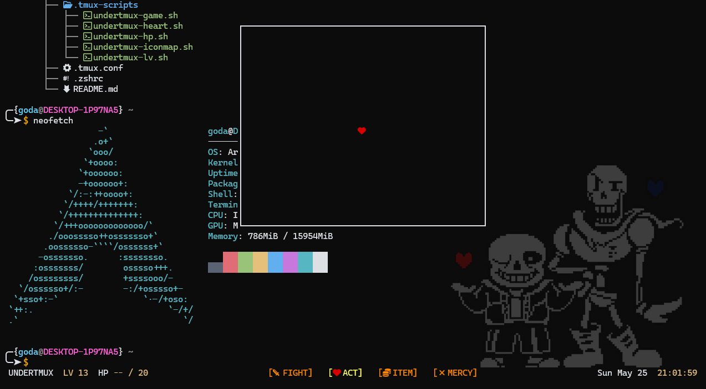

# UNDERTMUX

**Undertmux** is a custom `tmux` configuration inspired by the Undertale game UI.  



Displayed values:

- Session name
- `LV` uptime hours
- `HP` battery lifetime
- Windows
- Date & Time

---

## Instalation

```bash
git clone https://github.com/God4n/undertmux.git
cd undertmux
cp -r .tmux-scripts ~/.
```

copy the content of the `.tmux.conf` and `.zshrc` configuration files to avoid override your configurations.

---
